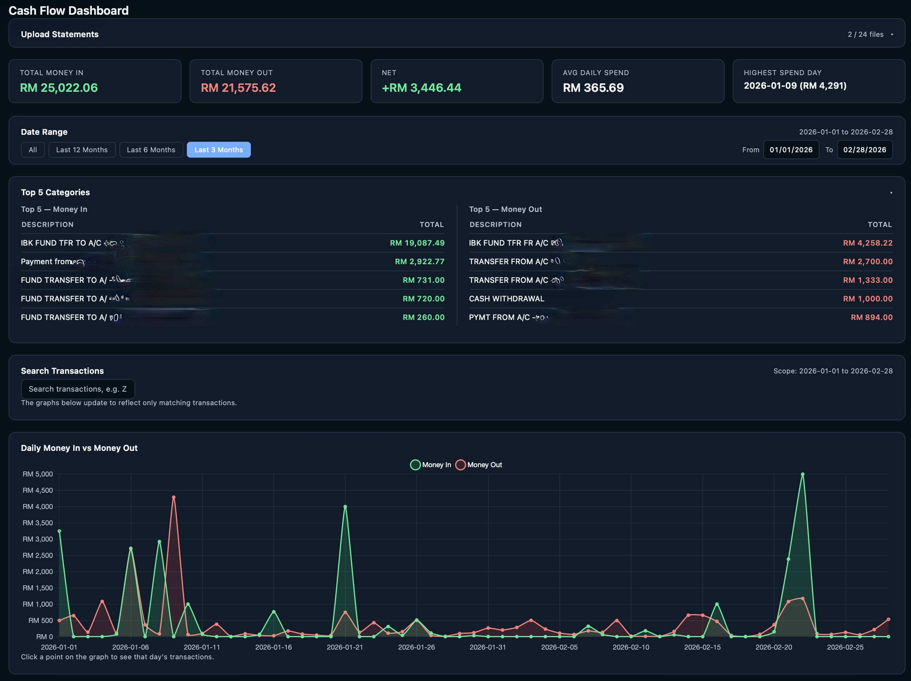

# Cash Flow Dashboard
A single-file, self-contained HTML dashboard for visualizing Maybank PDF statements. Upload your statements, get an interactive daily cash flow view, no server, no install, no data leaving your browser.

## Features

- **Local PDF parsing** — upload up to 24 Maybank PDF statements directly in the browser. Text extraction and transaction parsing happen entirely client-side.
- **Daily cash flow chart** — an interactive line chart of money in vs. money out per day, plus a net cash flow bar chart, both with hover tooltips.
- **Click-to-inspect** — click any point or bar to see the full list of transactions for that day.
- **Date range controls** — quick presets (All, Last 12/6/3 Months) or a custom From/To date picker. All charts, tables, and totals update to match the selected range.
- **Search** — filter transactions by description (e.g. "ZUS", "SHOPEE", "TENAGA"). The charts and results table update to show only matching transactions, so you can see when and how often something occurred.
- **Top 5 categories** — collapsible panel showing your top 5 income and top 5 expense descriptions by total value, for the selected date range.
- **Reconciliation check** — each uploaded statement's parsed totals are automatically compared against its printed TOTAL CREDIT / TOTAL DEBIT figures, so you know the data is accurate.
- **CSV export** — download all parsed transactions (date, description, type, amount) as a CSV file.
- **No backend, no tracking** — everything runs locally in your browser. Statements are never uploaded to any server.

## How it works

The dashboard embeds [PDF.js](https://mozilla.github.io/pdf.js/) (Mozilla's PDF library) directly in the HTML file. When you upload a statement:

1. The PDF is read as bytes in the browser (no upload to any server).
2. PDF.js extracts the text and position of every line on every page.
3. The dashboard reconstructs each row of the statement table from that positional text (similar to what a "PDF to text with layout" tool does).
4. A parser reads each transaction line — date, description, amount, and running balance — and pulls out the merchant/reference detail from the lines underneath it.
5. Transactions from all uploaded statements are merged, grouped by day, and rendered as the dashboard you see.

Everything after upload — parsing, charting, search, export — runs in memory in your browser tab. Closing the tab clears the data; nothing is saved or sent anywhere.

## Usage

1. Open `Cash-Flow-Dashboard.html` in a browser (Chrome or Safari, desktop or mobile).
2. In the **Upload Statements** panel, drag and drop your Maybank PDF statements, or click **Choose Files** (up to 24 at a time).
3. Click **Process Statements**. Each file is parsed in turn; you'll see a per-file status (✓ reconciled, ⚠ mismatch, or an error) and a running summary.
4. Once processing finishes, the dashboard populates automatically:
   - Use the **Date Range** panel to switch between presets or pick a custom range.
   - Use **Search Transactions** to filter by keyword.
   - Click any chart point/bar to see that day's transaction detail.
   - Click **Export CSV** (bottom of the page) to download all transactions.
5. To load a different set of statements, expand the Upload panel again and repeat.

No installation is required — it's a single HTML file you can open directly, share, or host as a static page.

## Statement format

This dashboard is built for **Maybank savings/current account PDF statements** with a text-based (not scanned/image) layout — the standard downloadable statement from Maybank's online banking. It reads:

- Transaction date, description, and amount (with debit `-` / credit `+` indicator)
- The merchant or reference name on the line(s) below each transaction
- Each statement's `TOTAL CREDIT` / `TOTAL DEBIT` footer, used for the reconciliation check

## Limitations

- **Maybank-specific.** The parser is built around Maybank's exact statement layout. Statements from other banks won't parse correctly.
- **Text-based PDFs only.** Scanned or image-based PDFs (no selectable text) can't be read — PDF.js can only extract text that actually exists in the file.
- **Occasional missing merchant names.** In rare cases where a transaction's detail line falls exactly at a page break, the merchant name may be omitted (the amount and date are always still captured correctly).
- **No duplicate detection.** Uploading the same statement twice will double-count it. Remove duplicates from the file list before processing if needed.
- **Browser support.** Works in current versions of Chrome and Safari. Other modern browsers should work but haven't been explicitly tested.

## Tech stack

- Vanilla HTML/CSS/JavaScript — no build step, no framework
- [Chart.js](https://www.chartjs.org/) for charts (inlined)
- [PDF.js](https://mozilla.github.io/pdf.js/) for PDF text extraction (inlined, classic/UMD build for broad browser compatibility)

## Privacy

All processing happens locally in your browser. No statement data, transaction details, or files are transmitted to any server at any point.
